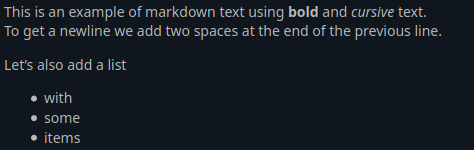

# Posting, reading, basic functions.

!!! warning
    Depending on your instance some of the options might not be available or have different defaults

After registering and logging in you're presented with your timeline in right column and new post form with timeline list and notifications in the left column.

Posts will contain the text you are posting, but some content will be modified:

1. Mentions: Mentions have the form of @user or @user<span></span>@instance.tld. These will become links to the user's profile. In addition, the mentioned user will always get a notification about the post they have been mentioned in, so only mention users that you want to receive this message.
2. URLs: URLs like `http://example.com` will be automatically  be turned into a clickable links.
3. Hashtags: Hashtags like #cofe will also be turned into links.
4. There is a default character limit of 5000 characters.

Let's clear up some basic stuff. When you post something it's called a **post** or it could be called a **status** or even a **toot** or a **prööt** depending on whom you ask. Post has body/content but it also has some other stuff in it - from attachments, visibility scope, subject line...

**Emoji** are small images embedded in text, there are two major types of emoji: [unicode emoji](https://en.wikipedia.org/wiki/Emoji) and custom emoji. While unicode emoji are universal and standardized, they can appear differently depending on where you are using them or may not appear at all on older systems. Custom emoji are a more *fun* kind - instance administrator can define many images as *custom emoji* for their users. This works very simple - custom emoji is defined by its *shortcode* and an image, so that any shortcode enclosed in colons get replaced with image if such shortcode exist.
Let's say there's a `:pleroma:` emoji defined on an instance. That means  
> First time using :pleroma: pleroma!  

will become  
> First time using  pleroma!  

Note that you can only use emoji defined on your instance, you cannot "copy" someone else's emoji, and will have to ask your administrator to copy emoji from other instance to yours.  
Lastly, there's two convenience options for emoji: an emoji picker (smiley face to the right of "submit" button) and autocomplete suggestions - when you start typing :shortcode: it will automatically try to suggest you emoji and complete the shortcode for you if you select one. If emoji doesn't show up in suggestions nor in emoji picker it means there's no such emoji on your instance, if shortcode doesn't match any defined emoji it will appear as text.

**Attachments** are fairly simple - you can attach any file to a post as long as the file is within maximum size limits. If you're uploading explicit material you can mark all of your attachments as sensitive (or add the `#nsfw` tag) - it will hide the images and videos behind a warning so that it won't be displayed instantly.

**Subject line** also known as **CW** (Content Warning) could be used as a header to the post and/or to warn others about contents of the post having something that might upset somebody or something among those lines. Several applications allow to hide post content leaving only subject line visible. Using a subject line will not mark your images as sensitive, you will have to do that explicitly (see above).

**Visiblity scope** controls who will be able to see your posts. There are four scopes available:

1. `Public`: This is the default, and some fediverse software, like GNU Social, only supports this. This means that your post is accessible by anyone and will be shown in the public timelines.
2. `Unlisted`: This is the same as public, but your post won't appear in the public timelines. The post will still be accessible by anyone who comes across it (for example, by looking at your profile) or by direct linking. They will also appear in public searches.
3. `Followers only`: This will show your post only to your followers. Only they will be able to interact with it. Be careful: When somebody follows you, they will be able to see all your previous `followers only` posts as well! If you want to restrict who can follow you, consider [locking your account down to only approved followers](../settings#profile).
4. `Direct`: This will only send the message to the people explicitly mentioned in the post.

A few things to consider about the security and usage of these scopes:

- None of these options will change the fact that the messages are all saved in the database unencrypted. They will be visible to your server admin and to any other admin of a server who receives this post. Do not share information that you would consider secret or dangerous. Use encrypted messaging systems for these things.
- Follower-only posts can lead to fragmented conversations. If you post a follower-only post and somebody else replies to it with a follower-only post, only people following both of you will see the whole conversation thread. Everybody else will only see half of it. Keep this in mind and keep conversations public if possible.
- Changing scopes during a thread or adding people to a direct message will not retroactively make them see the whole conversation. If you add someone to a direct message conversation, they will not see the post that happened before they were mentioned.
* **Reply-to** if you are replying to someone, your post will also contain a note that your post is referring to the post you're replying to. Person you're replying to will receive a notification *even* if you remove them from mentioned people. You won't receive notifications when replying to your own posts, but it's useful to reply to your own posts to provide people some context if it's a follow-up to a previous post. There's a small "Reply to ..." label under post author's name which you can hover on to see what post it's referring to.

Sometimes you may encounter posts that seem different than what they are supposed to. For example, you might see a direct message without any mentions in the text. This can happen because internally, the Fediverse has a different addressing mechanism similar to email, with `to` and `cc` fields. While these are not directly accessible in PleromaFE, other software in the Fediverse might generate those posts. Do not worry in these cases, these are normal and not a bug.

## Rich text

By default new posts you make are plaintext, meaning you can't make text **bold** or add custom links or make lists or anything like that. However if your instance allows it you can use Markdown or BBCode or HTML to spice up your text, however there are certain limitations to what HTML tags and what features of Markdown you can use.

Here is a small example of some text in markdown.

```
This is an example of markdown text using **bold** and *cursive* text.  
To get a newline we add two spaces at the end of the previous line.

Let's also add a list

* with
* some
* items
```

If you set the input-method to Markdown, and post this, it will look something like



## Other actions

In addition to posting you can also *favorite* posts also known as *liking* them and *repeat* posts (also known as *retweeting*, *boosting* and even *reprööting*). Favoriting a post increments a counter on it, notifies the post author of your affection towards that post and also adds that post to your "favorited" posts list (in your own profile, "Favorites" tab). Reprööting a post does all that and also repeats this post to your followers and your profile page with a note "*user* repeated post".

Your own posts can be deleted, but this will only reliably delete the post from your own instance. Other instances will receive a deletion notice, but there's no way to force them to actually delete a post. In addition, not all instances that contain the message might even receive the deletion notice, because they might be offline or not known to have the post because they received it through a repeat. Lastly, deletion notice might not reach certain frontends and clients - post will be visible for them until page refresh or cache clear, they probably won't be able to interact with it apart from replying to it (which will have reply-to mark missing).

If you are a moderator, you can also delete posts by other people. If those people are on your instance, it will delete the post and send out the deletion notice to other servers. If they are not on your instance, it will just remove the post from your local instance.

There's also an option to report a user's post which can be used to notify your (and optionally the other instance's) admin that someone is being naughty.
